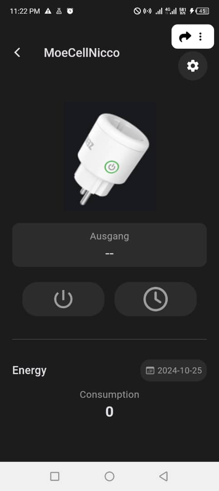

# stromleser_app

A Flutter application for controlling and monitoring a device's settings, designed to replicate a specific UI with best practices in mind. The app provides an interface for the control of power and timer, displays output status, and includes an energy usage section.

---

## Table of Contents

1. [Overview](#overview)
2. [Features](#features)
3. [Screenshots](#screenshots)
4. [Project Structure](#project-structure)
5. [Installation](#installation)
6. [Usage](#usage)
7. [Dependencies](#dependencies)
8. [Best Practices](#best-practices)
9. [Contributing](#contributing)
10. [License](#license)

---

## Overview

The **Stomleser App** is a Flutter application developed to replicate a custom UI for device monitoring and control. This app demonstrates good coding practices by structuring the UI components into reusable widgets. The app UI includes an app bar with various controls, power/timer buttons, an energy usage section, and a consumption display.

---

## Features

- **Custom App Bar**: Displays the device name, back button, share icon, settings button, and more.
- **Power and Timer Buttons**: Provide a UI for toggling the device's power and setting a timer.
- **Energy Section**: Shows energy consumption details and provides a date picker UI.
- **Modular Components**: Structured with reusable widgets for better code organization.

---

## Screenshots

### Device Control Screen

---

## Installation

### Prerequisites

- Flutter SDK: [Install Flutter](https://flutter.dev/docs/get-started/install)
- IDE: You can use Android Studio, Visual Studio Code, or any other IDE that supports Flutter development.

### Steps

1. **Clone the repository**:

- git clone https://github.com/yourusername/device-control-app.git
- Navigate to the project directory:
- cd device-control-app
- Get the dependencies:
- flutter pub get
- Run the app:
- flutter run

## Dependencies
- flutter/cupertino.dart - For iOS-specific icons and widgets.
- font_awesome_flutter - Provides Font Awesome icons.
- flutter/material.dart - For core Flutter widgets and Material Design components.
- To install dependencies, simply run:

flutter pub get

